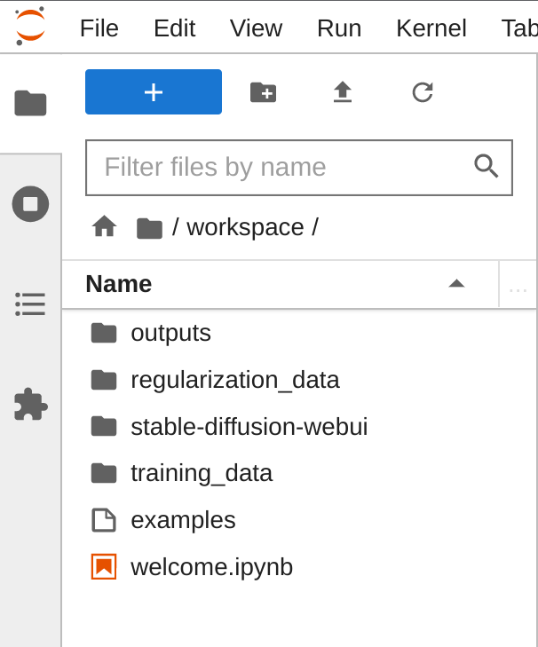
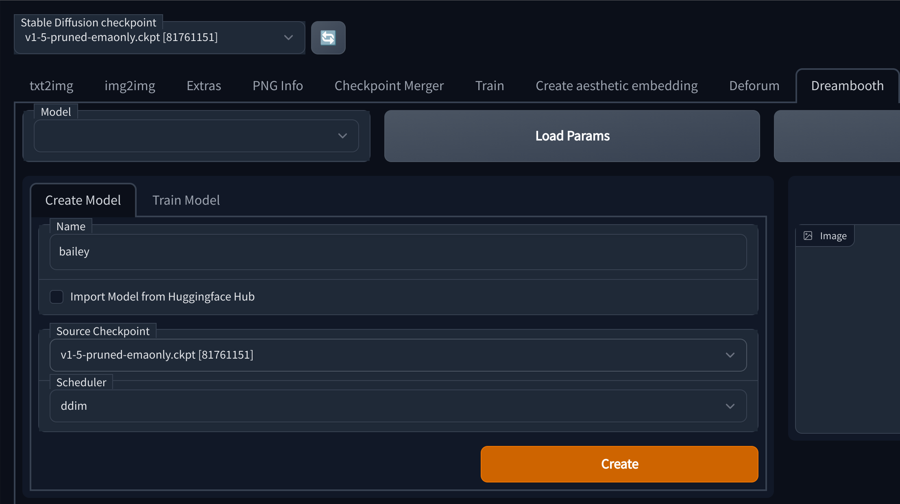
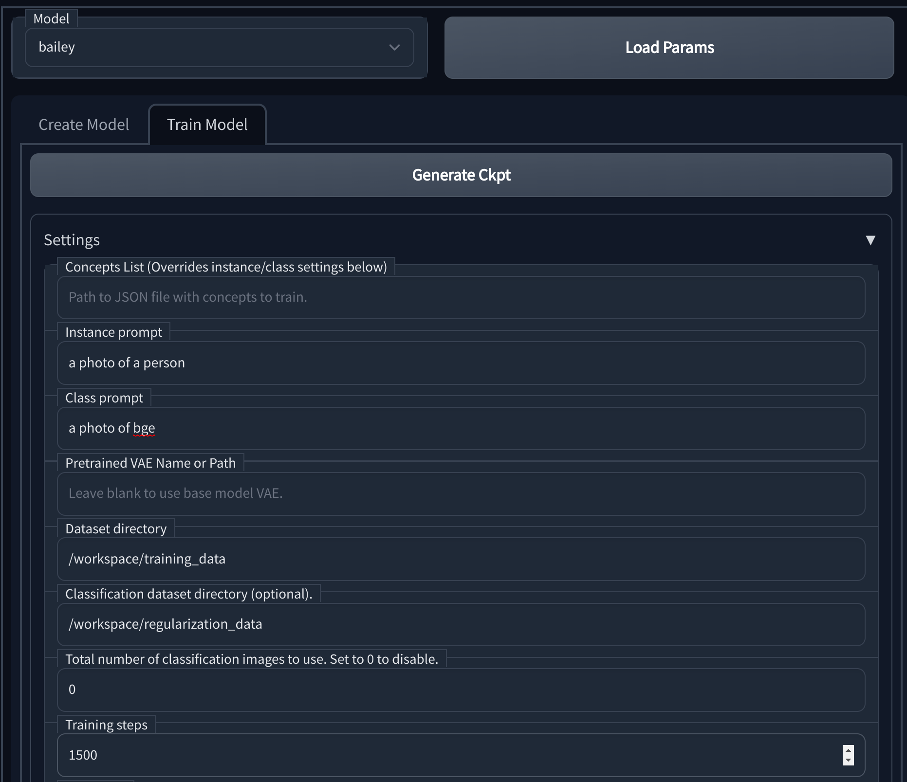
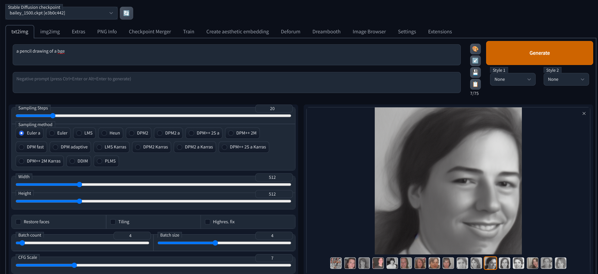

### Data Perparation

The first thing you need to do in order to train a new model is to prepare the training data. You will need 2 sets of images:
* Training Images - These should be images of the thing you want to train on, for example if you want to teach your model abouta a new person, this should be pictures of that person (more details below)
* Regularization Images - These are should images of not the thing you want to train on but are of the same class, for example if you want to teach your model about a new person, this should include images of other people. The github user [djbielejeski](https://github.com/djbielejeski) has a number of datasets that can be used for this purpose, in general the repo names follow the pattern of `https://github.com/djbielejeski/Stable-Diffusion-Regularization-Images-${CLASS}`, for example [Stable-Diffusion-Regularization-Images-person_ddim](https://github.com/djbielejeski/Stable-Diffusion-Regularization-Images-person_ddim) contains images of people that can be used for regularization ([helper script](https://github.com/beverts312/machine-learning/blob/main/tools/dreamstudio/get_regularization_images.sh)). An alternative to using a dataset like this would be to create a bunch of reuglarization images using stable-diffusion itself. In either case you will likely want to use about 200 images. *You do not need to provide regularization images if training on replicate*

All images should be 512x512 and in the png format.

For training images, you will need a variety of images of the thing you want to train on. They should be from different angles, different zoom levels, and with different backgrounds. I will update the table below as I experiment with more classes.

|class|image distribution|
|-|-|
|person|2-3 full body, 3-5 upper body, 5-12 close up on face|

### Training

In order to train a new model you will need a high graphics card, I wont be specific because this is a rapidly changing space but you will likely have trouble with less than 24gb of VRAM.
Since I do not have that kind of hardware I have been using [RunPod](https://runpod.io?ref=r4m3cjep) (referral link), which offers pretty cheap GPU's in the cloud. If using RunPod, I would reccomend using a configuration with:
* 1x GPU with 24GB of VRAM
* Default Container Disk Size
* 40 GB Volume Disk Size
* RunPod Stable Diffusion v1.5 (at time of writing v2 is available but does not seem to work as well, steps are roughly the same for v2)

I would reccomend deploying on-demand but you can roll the dice and try to save money with a spot instnace.

After the pod is provisioned I would connect to the web ui ("Connect via HTTP [Port 3000]" in the ui) in one tab and connect to the JupyterLab in another tab.

In the JupyterLab tab create 2 directories:
* `training_data` - Place your training images in here
* `regularization_data` - Place your regularization images in here

Then in the web ui tab:
1. Go to the Dreambooth tab
2. On create model, enter a name for your model, select a source checkpoint and click create

3. After the model is created, move to the train tab
4. Set the instance prompt to something describes the training set using a key that you want to use in future generations, so if the key was "bge" the instance prompt could be "a photo of bge"
5. Set the class prompt to something that describes the regularization data, so continueing with the previous example you could use "a photo of a person"
6. Set the dataset directory to `/workspace/training_data`
7. Set the regularization dataset directory to `/workspace/regularization_data`
8. Set the number of training steps as desired, I would reccomend starting with 1500
9. Click train (should take 10-30 minutes depending on the hardware and dataset size)

**Trying your model out:** After training is completed you can go back to the `txt2img` tab and try it out, if you dont see your model available you may need to click the refresh icon next to the checkpoint dropdown.

**Getting your model out:** You can find the created checkpoints under `/workspace/stable-diffusion-webui/models/Stable-Diffusion/${MODEL_NAME}_${STEPS}.ckpt` in your JupyterLab tab, from there you can download them and use them in the future.
An alternative to downloading it locally could be to open a teriminal in your JupyterLab tab and upload the model to a cloud storage provider like [wasabi](https://wasabi.com/) or [s3](https://aws.amazon.com/s3/).

#### Using Replicate

An alternate option is to use replicate however this is going to be much more expensive ($2.50 at a minumum, probably a fair bit more with a realistic size ). They have a nice blog post [here](https://replicate.com/blog/dreambooth-api) on how to set that up. [Here](https://github.com/beverts312/machine-learning/blob/main/bails_ml_wrappers/training/dreamstudio_replicate.py) you can find a little script I wrote to simplify that process.

An advantage to this approach other than how easy it is to run training is that your model is immediately available for use via the replicate api. I plan to put together a little sample to make it easy to use the replicate api to run models trained using an alternate method such as the one described in the section above.

### Useful Resources

* [/d8ahazard/sd_dreambooth_extension](https://github.com/d8ahazard/sd_dreambooth_extension) - Webui Dreambooth extension
* [Automatic1111/stable-diffusion-webui](https://github.com/AUTOMATIC1111/stable-diffusion-webui) - Feature rich fork of the stable diffusion web ui
* [JoePenna/Dreambooth-Stable-Diffusion](https://github.com/JoePenna/Dreambooth-Stable-Diffusion) - This is a great refernce repo where some work in this space is going on, there are a few guides there on how to train using different platforms using notebooks in that repo, I didnt have a lot of success with them specifically but there is a lot of good information there.